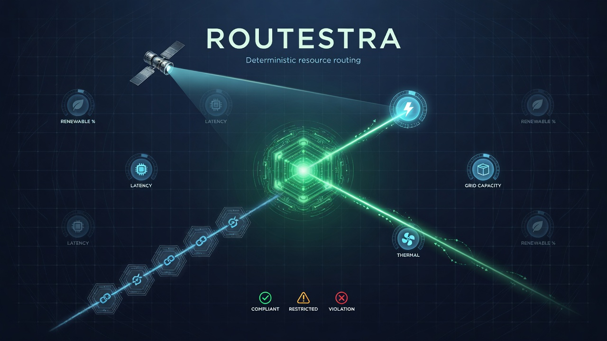

[](https://github.com/sadpig70/Routestra/actions/workflows/ci.yml)

# Routestra

> **다차원 물리 제약 하에서 자원(컴퓨트·전력·열·자금)을 최적 위치로 라우팅/배치하는 결정론 플랫폼.**
> `score → route → bound → verify` + hash-chain 라우팅 원장 — 하나의 커널, N개 도메인 팩.

Routestra는 **하나의 결정론 라우팅 커널 + N개 도메인 팩** 구조다. HELIX corpus의 자원-라우팅
프로젝트들(SkyGrid·PowerRoam·InferMesh·ThermalCascadeBound·ThermalPlumeStage·WasteStack·
SeasonBat·WattWeaveAI·SoilBond·ClimateMesh)이 도메인 공식만 바꿔 같은 라우팅 기계를 반복 구현해
왔는데, Routestra는 그 기계를 커널로 한 번만 정의하고 각 도메인을 **라우팅 팩**으로 얹는다.

## -stra 플랫폼 패밀리
> 🔗 **생태계 데모**: [stra-demo](https://github.com/sadpig70/stra-demo) — route → clear → certify → attest가 한 결정을 함께 처리하는 end-to-end 데모.


Routestra는 [HELIX](../README.md) 파생 **`-stra` 3형제**의 세 번째다 — 셋 다 독립 저장소로 자립 구동.

| 플랫폼 | 동사 | 역할 |
|---|---|---|
| [Attestra](../Attestra/README.md) | **attest** | 위임 행위를 증언 (verdict/attestation) |
| [Clearstra](../Clearstra/README.md) | **clear** | 시장을 청산 (clearing exchange) |
| **Routestra** | **route** | 자원을 라우팅 (resource routing/siting) |

세 플랫폼은 **verdict severity 대수를 공유**한다: `valid < thin < breach`(Attestra) ≅
`compliant < restricted < violation`(Routestra bound). Routestra의 라우팅 판정을 Attestra가 증언하는
조합이 자연스럽다.

## 라우팅 기계 (실코드 근거)

각 도메인은 아래 단계 중 자기 것을 구현한다. 커널이 오케스트레이션하고, 팩은 공식만 준다.

| 단계 | 커널 함수 | 실코드 근거 |
|---|---|---|
| **score** | `score(candidate, thresholds, evidence, score_fn)` | `SkyGrid.evaluate_power_availability` |
| **route** | `route(demand, candidates, score_fn)` — 최적 eligible 선택 | `SkyGrid.plan_compute_roaming` |
| **bound** | `bound(dimensions)` — compliant/restricted/violation 병합 | `ThermalCascadeBound.evaluate_site` |
| **verify** | `verify_provenance(plan, chain)` | `SkyGrid.verify_provenance` |

`compute-power`가 레퍼런스 팩(SkyGrid parity), `thermal-cascade`가 bound 레퍼런스(ThermalCascadeBound parity).

## 구조

```
Routestra/
├── README.md
├── .pgf/                          # PGF 설계·계획·상태
│   ├── DESIGN-Routestra.md        #   메인 설계 (Gantree + PPR)
│   ├── DESIGN-RoutestraPacks.md   #   (decomposed) 1차 도메인 팩 10종
│   ├── WORKPLAN-Routestra.md      #   실행 계획
│   └── status-Routestra.json
├── .pgxf/INDEX-Routestra.json     # PGXF 인덱스 (32 노드)
├── routestra_core/                # ★ 커널 (stdlib only)│   ├── candidate · score · route · bound · verdict · provenance · ledger · fingerprint · determinism
├── routestra_packs/               # ★ 도메인 팩│   └── compute_power/ (레퍼런스) · thermal_cascade/ (bound 레퍼런스) · ...
├── schemas/ · cli.py · tests/     #```

> 현재 상태: **구현·검증 완료**. 커널 + 11 도메인 팩 전부 구현, 결정론 unittest + parity + determinism boundary 통과, CI green.

## 1차 도메인 팩 (10종)

`compute-power`(레퍼런스) · `thermal-cascade`(bound 레퍼런스) · `power-roam` · `inference-grid` ·
`watt-fabric` · `soil-carbon` · `thermal-plume` · `waste-stack` · `season-battery` · `climate-resilience`.

**추가 흡수 팩 (총 11종):** `flow-mesh` — FlowMesh(파이프라인 병목). **machine-aware routing**이
FlowMesh의 `_decide(utilization)`가 계산된 물리 지표를 임계값으로 3단계 분류하는 threshold-bound,
즉 Routestra `bound`(compliant/restricted/violation)와 동형임을 실코드로 확인해 여기로 라우팅했다
(원본과 parity 테스트 동봉).

각 팩은 `source_project`로 원본 저장소(github.com/sadpig70/*)를 추적한다.

## 결정론 경계

- **커널 + 팩 함수 = 순수 결정론**: stdlib only, 시계·네트워크·AI 없음. 시간은 주입(`now`),
  hash 입력에서 `now`/`*_at` 제외 → 시간 무관 재현.
- **도메인 피드(위성·시세·예측) = 메타층** — Routestra 경계 밖(후보/telemetry를 *생산*).

## 라이선스

MIT License © 2026 sadpig70 (Jung Wook Yang)
